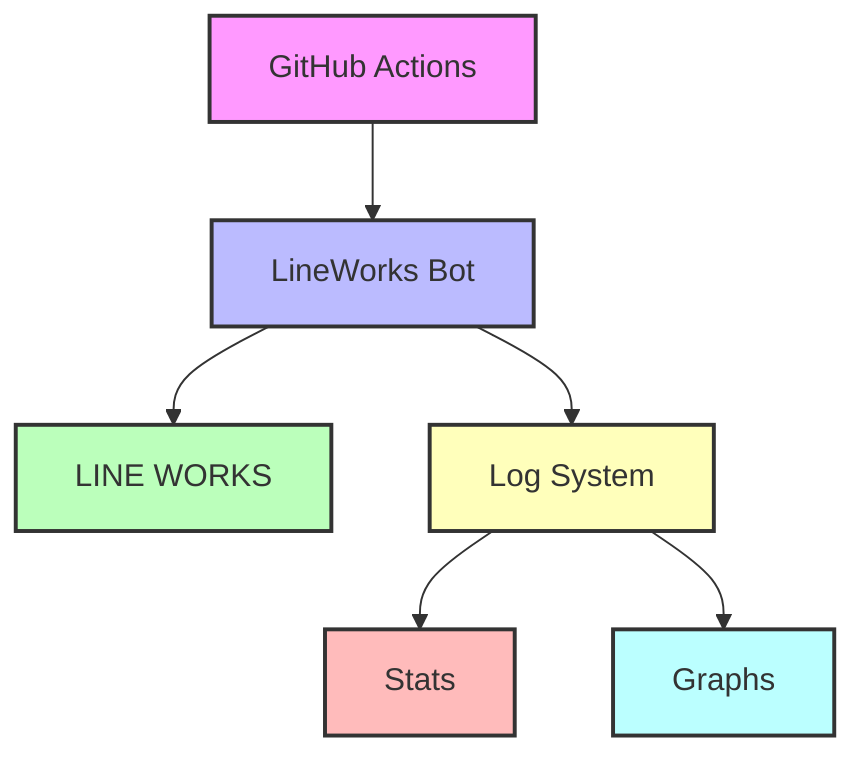

# LINE WORKS Bot Server with GitHub Actions

このリポジトリはGitHub Actionsを使用してLINE WORKSのボットを自動実行するプロジェクトです。

## アーキテクチャ

## 機能

- GitHub Actionsによる自動化
- 毎5分ごとにボットを実行
- 自動的なREADME更新
- ログの定期的な更新とアーカイブ
- LINE WORKSとの連携
- MQTTプロトコルを使用したメッセージング
- テキストメッセージとFlexメッセージの送信

## ログシステム

### データ収集
- 起動時間と最終受信時間の記録
- メッセージの総数
- メッセージタイプ別の統計
- コマンドの総数
- 時間帯別のメッセージ数

### データ可視化
- 時間帯別のメッセージ数のグラフ
- メッセージタイプ別の分布
- コマンドの使用頻度

## GitHub Actionsの設定

- **ワークフロー**: `line_works.yml`
- 定期実行: 毎5分
- タスク:
  - Python環境のセットアップ
  - 依存関係のインストール
  - ボットの実行
  - ログのアーカイブ
- **README更新ワークフロー**: `readme.yml`
  - 定期実行: 毎日0時
  - タスク:
    - READMEの自動生成
    - 変更のコミットとプッシュ

## 最終更新
2025-03-22 10:03:19 (JST)